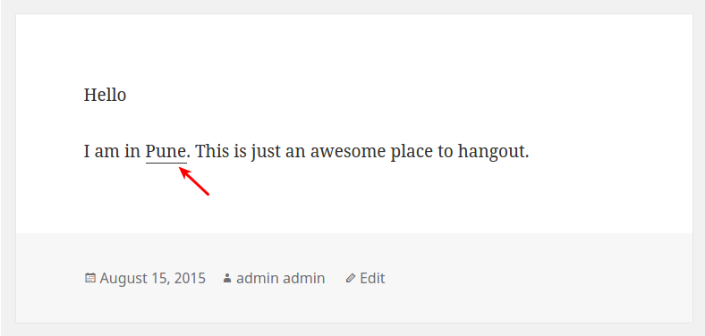

<!-- DO NOT EDIT THIS FILE; it is auto-generated from readme.txt -->
# ShareWhere

Using ShareWhere plugin you can share your location in post/page using google map.

**Contributors:** [littlemonks](https://profiles.wordpress.org/littlemonks), [pranalipatel](https://profiles.wordpress.org/pranalipatel), [sanket.parmar](https://profiles.wordpress.org/sanket.parmar)  
**Tags:** [location](https://wordpress.org/plugins/tags/location), [share](https://wordpress.org/plugins/tags/share), [map](https://wordpress.org/plugins/tags/map), [google map](https://wordpress.org/plugins/tags/google map), [google](https://wordpress.org/plugins/tags/google), [location share](https://wordpress.org/plugins/tags/location share), [wp location share](https://wordpress.org/plugins/tags/wp location share), [locator](https://wordpress.org/plugins/tags/locator), [geo locator](https://wordpress.org/plugins/tags/geo locator), [Addresses](https://wordpress.org/plugins/tags/Addresses), [Add location](https://wordpress.org/plugins/tags/Add location)  
**Requires at least:** WordPress 4.0  
**Tested up to:** WordPress 4.3.1  
**Stable tag:** 1.2  
**License:** [GPLv2 or later](http://www.gnu.org/licenses/gpl-2.0.html)  

## Description ##

Do you want to share any location? ShareWhere plugin shares the location you want.

You just have to select location in google map and insert that location into post/page.

## Installation ##

### From your WordPress dashboard ###
1. Visit 'Plugins > Add New'
2. Search for 'ShareWhere'
3. Activate ShareWhere from your Plugins page.

### From WordPress.org ###
1. Download ShareWhere.
2. Upload the 'sharewhere' directory to your '/wp-content/plugins/' directory, using your favorite method (ftp, sftp, scp, etc...)
3. Activate ShareWhere from your Plugins page.

## Frequently Asked Questions ##

### Can I use my existing WordPress theme? ###
Yes! ShareWhere works out-of-the-box with nearly every WordPress theme.

## Screenshots ##

### Add Location

### Google Map

### Search Places

### Location Type

### After insert into post/page

### Location on frontend

### Add Location in WordPress Comment

### Add Location in BuddyPress Activity

## Changelog ##

### 1.2 - Oct 30, 2015 ###
* Add Location in BuddyPress Activity

### 1.1 - Aug 31, 2015 ###
* Add Location in WordPress Comment

### 1.0.1 - Aug 20, 2015 ###
* Removed unwanted code

### 1.0 - Aug 20, 2015 ###
* Inital Release
* Share location using google map in post/page
* Added Readme

## Upgrade Notice ##

### 1.2 - Oct 30, 2015 ###
Add Location in BuddyPress Activity

## Roadmap ##

* Share location in BuddyPress Comments
* Share location in bbPress Forums
* include map instead of location name

