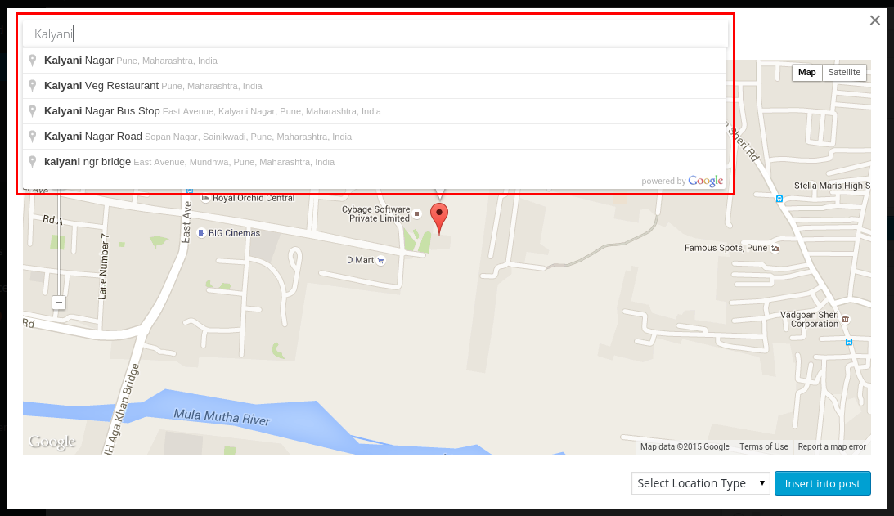

<!-- DO NOT EDIT THIS FILE; it is auto-generated from readme.txt -->
# ShareWhere

Using ShareWhere plugin you can share your location in post/page using google map.

**Contributors:** [sanketparmar](https://profiles.wordpress.org/sanketparmar), [pranalipatel](https://profiles.wordpress.org/pranalipatel)  
**Tags:** [location](https://wordpress.org/plugins/tags/location), [share](https://wordpress.org/plugins/tags/share), [map](https://wordpress.org/plugins/tags/map), [google map](https://wordpress.org/plugins/tags/google map), [google](https://wordpress.org/plugins/tags/google), [location share](https://wordpress.org/plugins/tags/location share), [wp location share](https://wordpress.org/plugins/tags/wp location share), [locator](https://wordpress.org/plugins/tags/locator), [geo locator](https://wordpress.org/plugins/tags/geo locator), [Addresses](https://wordpress.org/plugins/tags/Addresses), [Add location](https://wordpress.org/plugins/tags/Add location)  
**Requires at least:** WordPress 4.0  
**Tested up to:** WordPress 4.2.4  
**Stable tag:** 1.0  
**License:** [GPLv2 or later](http://www.gnu.org/licenses/gpl-2.0.html)  

## Description ##

Do you want to share any location? ShareWhere plugin shares the location you want. You just have to select location in google map and insert that location into post/page.

## Installation ##

You just need to search 'ShareWhere' in the search field. Once you’ve found our plugin you can view details about it such as the the point release, rating and description. Most importantly of course, you can install it by simply clicking “Install Now”.

## Frequently Asked Questions ##

### Can I use my existing WordPress theme? ###
Yes! ShareWhere works out-of-the-box with nearly every WordPress theme.

## Screenshots ##

### Add Location

### Google Map

### Search Places

### Location Type

### After insert into post/page

### Location on frontend

## Changelog ##

### 1.0 ###
* Inital Release
* Share location using google map in post/page
* Added Readme

## Roadmap ##

* Share location in BuddyPress Activity
* include map instead of location name

